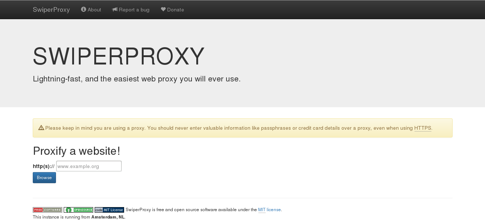

swiperproxy
===========

SwiperProxy is a very easy to use HTTP and HTTPS web proxy. View the
live demo at <https://proxy.donttrustrobots.nl>.

License
-------

SwiperProxy is licensed under the MIT license. See the `COPYING.md`
file in `/doc/`.

Download
--------

See <https://swiperproxy.github.io/download.html> for releases and git
checkout instructions.

Create a clone of this repository
---------------------------------

Clone the repo by running:
`$ git clone https://github.com/SwiperProxy/swiperproxy.git`

Support
-------

Commercial installation and support is not available. For general
community support, see <https://swiperproxy.github.io/contact.html>.
